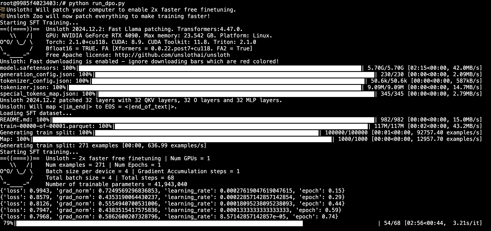
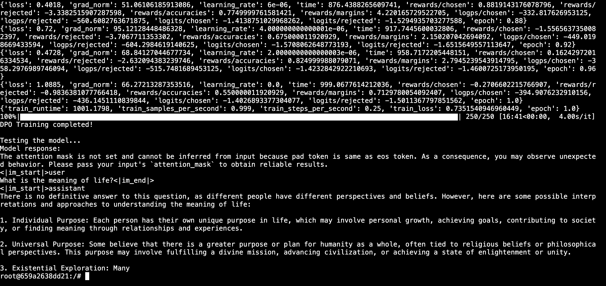

# Towards Finetuning a language model with RLHF

This repository contains a script for finetuning a language model with Direct Preference Optimization (DPO).

Specifically, the script finetunes a 4 bit quantized version of Meta's Llama 3.1 8B model [https://huggingface.co/unsloth/Meta-Llama-3.1-8B-bnb-4bit] in 2 steps (note: 4 bit quantized means the model weights are stored in 4 bits instead of the usual 16 bits which reduces the amount of memory required to store the model and increases the inference speed but makes the weights, and therefore the outputs of the model, less accurate). 

First, we do Supervised Fine-Tuning (SFT) on the mlabonne/FineTome-100k dataset [https://huggingface.co/datasets/mlabonne/FineTome-100k], which is a dataset of 100k instructions and responses. SFT just optimizes a cross entropy loss: after generating a token, we take its probability distribution and find the loss against the ground truth token. This step is usually done prior to any kind of preference tuning of language models (although it is not strictly required and probably does not have much of an impact currently as we only do it over a small subset of the dataset). The point is to learn a model whose output is an attempt to follow instructions and provide an answer to the prompt instead of just auto-completing it. Rather than instruction tuning the model ourselves, soon we may just start off with the instruction tuned version of the model instead [https://huggingface.co/unsloth/Meta-Llama-3.1-8B-Instruct-bnb-4bit].

SFT log:



Then we do Direct Preference Optimization (DPO) [https://arxiv.org/abs/2305.18290] over mlabonne/orpo-dpo-mix-40k [https://huggingface.co/datasets/mlabonne/orpo-dpo-mix-40k], which is a dataset of 40k instructions and responses. Each entry includes a prompt along with both a 'chosen' response (preferred) and a 'rejected' response (less preferred). DPO optimizes a binary cross-entropy loss over preference data. The point is to learn a new model whose outputs are similar to the 'chosen' response but different from the 'rejected' response.

Soon, we will switch to using Proximal Policy Optimization (PPO) [https://arxiv.org/abs/1707.06347] for RLHF [https://arxiv.org/abs/2203.02155] as that is ultimately our main focus. This will include assigning rewards to the responses of the model using a reward model [https://huggingface.co/Ray2333/GRM_Llama3.1_8B_rewardmodel-ft] and updating the model parameters using a PPO algorithm to maximize the reward.

However, just to get started, we used DPO as it is often used in practice as a drop in replacement to RLHF with PPO due to it's faster training time, simplicity, and similar results.

Here is an output of the final fine-tuned model in action:


Compare to what the base model generates:


# Steps to run the finetuning script on runpod:

1. Make a new runpod instance with the following configuration:
    - GPU: NVIDIA RTX 4090
    - Image: runpod/pytorch:2.1.0-py3.10-cuda11.8.0-devel-ubuntu22.04
    - RAM: 100GB
    - Container Disk: 100GB
    - Pod Volume: 100GB

2. Add run_rlhf_dpo.py to the instance

3. Install dependencies
```bash
pip install "unsloth[cu118-ampere] @ git+https://github.com/unslothai/unsloth.git"
```

4. Set PYTORCH_CUDA_ALLOC_CONF environment variable to reduce memory fragmentation:
```bash
export PYTORCH_CUDA_ALLOC_CONF=max_split_size_mb:128
```

That's it! You can now run the script:
```bash
python run_dpo.py
```
